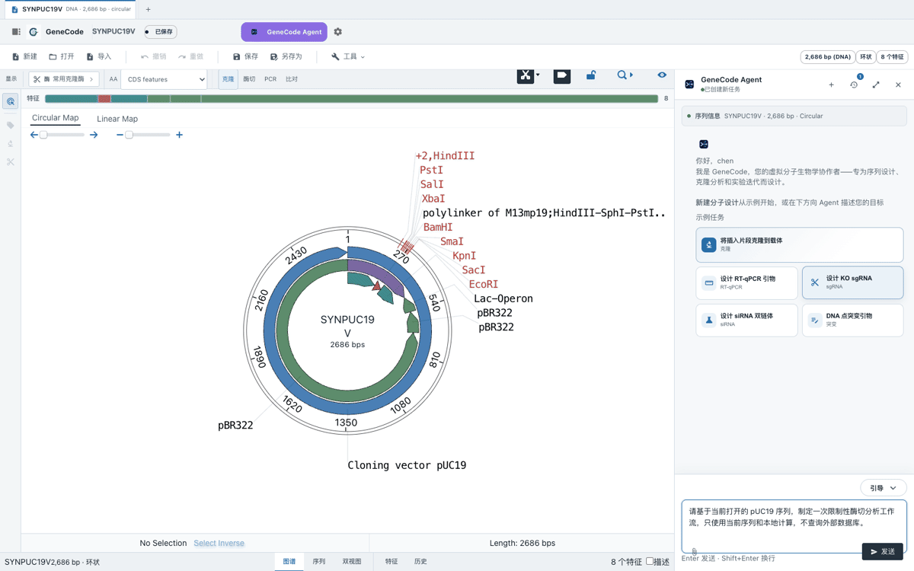

# genecode：分子生物学智能体

**English** | [简体中文](README.zh-CN.md)

> An Agent-assisted molecular sequence and cloning workbench that keeps the
> sequence canvas, deterministic biology tools, and execution history in one
> auditable workspace.

[](https://genecode-agent.pages.dev/)
[](https://github.com/zjuphD/GeneCode/actions/workflows/ci.yml)
[](https://github.com/zjuphD/GeneCode/stargazers)
[](https://tauri.app/)

**[Open the live demo](https://genecode-agent.pages.dev/)** ·
[Report an issue](https://github.com/zjuphD/GeneCode/issues)

<p align="center">
  <a href="https://genecode-agent.pages.dev/">
    
  </a>
</p>

<p align="center"><sub>Live workflow: submit a sequence-analysis task → Agent reads the active sequence → completed tool steps remain visible.</sub></p>

## Why GeneCode

Molecular-design work often gets split across a sequence editor, standalone
calculators, and a general chat window. GeneCode keeps those steps connected:
the Agent can work from the open sequence and selected region while the
deterministic biology layer remains the source of truth.

| | GeneCode | Standalone editor + general chat |
|---|---|---|
| Sequence context | Open document and selected region stay in context | Repeated manual copy and paste |
| Biology tools | Deterministic cloning and assay calculations | Results depend on disconnected tools |
| Traceability | Visible execution steps, history, and reviewable changes | Reasoning and edits are scattered |
| Deployment | Local-first desktop app plus a browser demo | Usually one environment or the other |

## Quick Start

```bash
git clone https://github.com/zjuphD/GeneCode.git
cd GeneCode/molecular-design-studio && npm install
npm run dev
```

Open `http://127.0.0.1:1420` to explore the frontend. For the full local Agent
service or desktop build, continue with the development sections below.

## Highlights

- Circular, linear, sequence, and split sequence-editor views
- GenBank/FASTA import, annotations, restriction sites, selections, and history
- Agent conversation history and visible execution-step flow
- Editor-aware Agent context for the open document and selected region
- Molecular cloning, RT-qPCR, sgRNA, siRNA, and mutagenesis workflows
- Local deterministic calculations with optional OpenAI-compatible model support
- Tauri desktop shell with a token-protected local Python API

## Repository layout

```text
.
├── molecular-design-studio/   # React, Tauri, and GeneCode OVE frontend
├── server.py                  # Local Agent/API entry point
├── server_pkg/                # Python Agent and biology implementation
├── tests/                     # Python regression and security tests
└── .github/workflows/ci.yml   # Frontend and backend CI
```

The root `index.html` and `assets/` preserve the browser-based Primer Design
Studio compatibility page served by `server.py`.

## Requirements

- Node.js 22+
- npm 10+
- Python 3.11+
- Rust stable and platform build tools for the Tauri desktop application

## Desktop development

```bash
git clone https://github.com/zjuphD/GeneCode.git
cd GeneCode/molecular-design-studio
npm install
npm run tauri:dev
```

Tauri reuses a healthy Agent service on `127.0.0.1:8000`, or starts the
repository's `server.py` sidecar automatically.

## Browser development

Use the same local token on the backend and frontend:

```bash
# terminal 1
GENE_CODE_API_TOKEN=dev-token python3 server.py --port 8000

# terminal 2
cd molecular-design-studio
VITE_AGENT_API_TOKEN=dev-token npm run dev
```

Then open `http://127.0.0.1:1420`.

## Optional model configuration

The deterministic biology tools work without a model. To enable an
OpenAI-compatible provider, configure it on the local backend only:

```bash
export AGENT_LLM_ENABLED=1
export AGENT_LLM_API_KEY="your-key"
export AGENT_LLM_MODEL="your-model"
export AGENT_LLM_BASE_URL="https://provider.example/v1"
```

Do not put API keys in frontend source files or commit `.env` files.

## Verification

```bash
cd molecular-design-studio
npm run typecheck
npm run lint
npm test -- --run
npm run build
npm run build:agent-sidecar
cargo check --manifest-path src-tauri/Cargo.toml

cd ..
AGENT_LLM_ENABLED=0 python3 -m unittest discover -s tests -p "test_*.py"
```

GitHub Actions runs the same frontend and backend quality gates on every push
and pull request.
